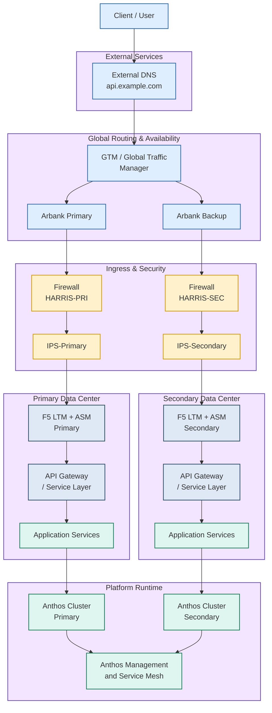

# Architecture Overview

This document provides a high-level architecture overview for the platform depicted in the attached system diagram.

## Notes

- The diagram illustrates a dual-site, highly available deployment pattern.
- Traffic enters through external DNS and global traffic management.
- Security enforcement is applied at the firewall and IPS layers before load balancing.
- F5 LTM + ASM acts as the main ingress and application security control point.
- Application services run on Anthos clusters in primary and secondary data centers.
- Anthos management provides orchestration and service-level consistency across sites.
